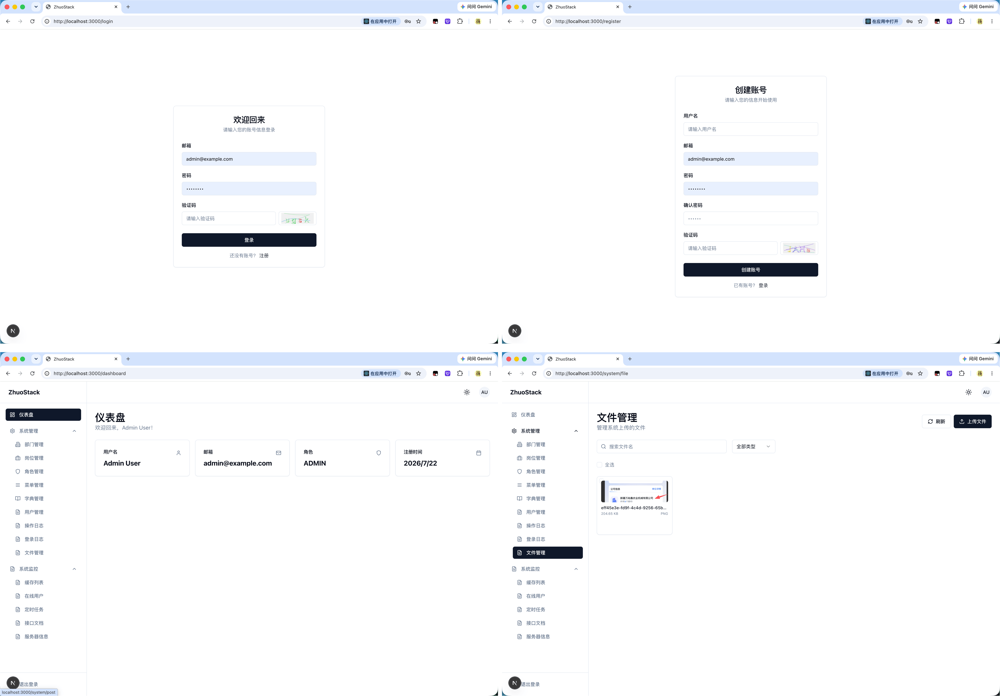
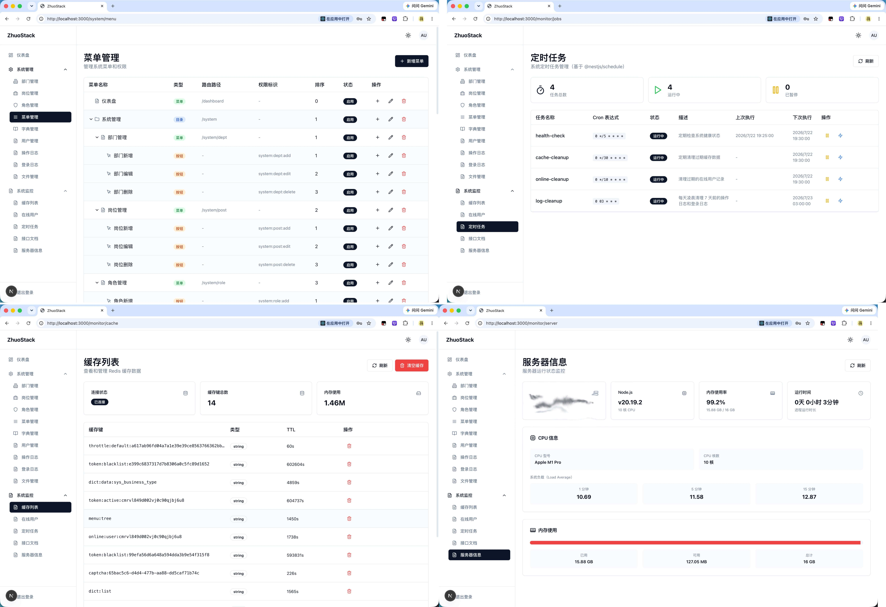
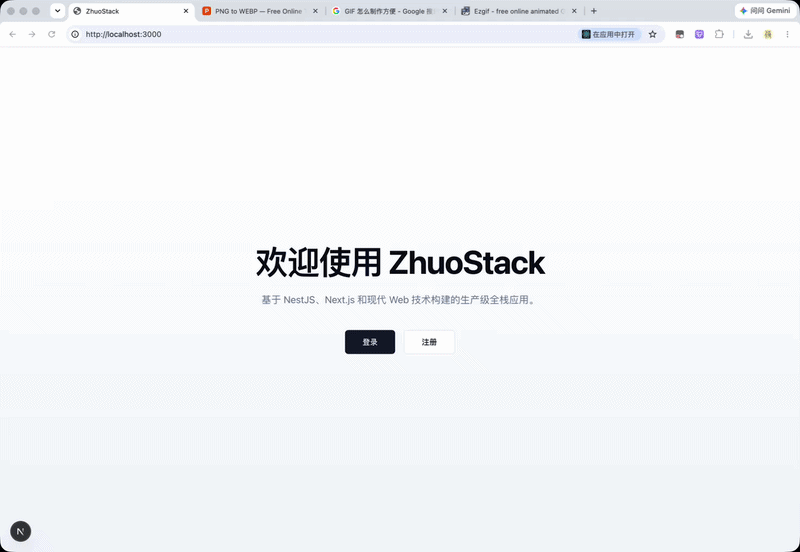
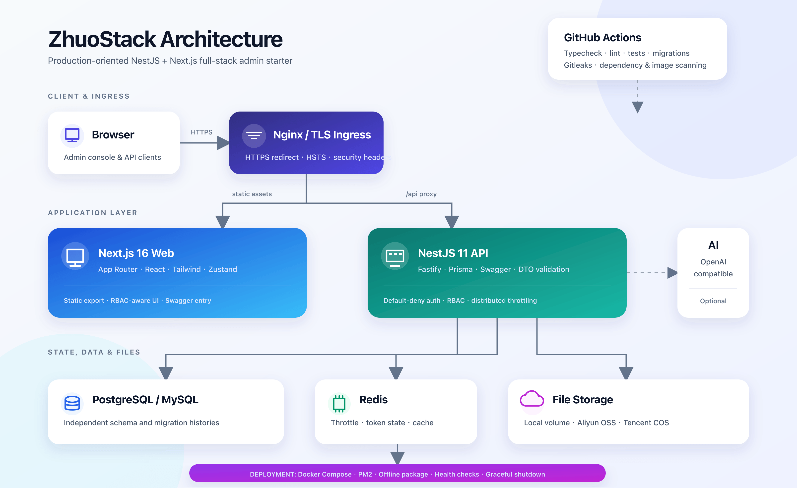

# ZhuoStack

面向生产环境的 NestJS + Next.js 全栈中后台开发脚手架，采用 pnpm Monorepo + Turborepo 组织，内置双数据库迁移、RBAC、Redis、多云文件存储和 Docker/PM2 部署能力。

## 界面预览

<p align="center">
  
</p>

登录、注册、仪表盘和文件管理。

<p align="center">
  
</p>

菜单权限、定时任务、Redis 缓存与服务器监控。

## 使用演示

<p align="center">
  
</p>

## 技术栈

| 类别      | 技术                    |
| --------- | ----------------------- |
| 包管理器  | pnpm                    |
| 构建编排  | Turborepo               |
| 后端框架  | NestJS 11               |
| HTTP 平台 | Fastify                 |
| ORM       | Prisma                  |
| 数据库    | PostgreSQL / MySQL      |
| 缓存      | Redis                   |
| 前端框架  | Next.js 16 (App Router) |
| CSS 框架  | Tailwind CSS 4          |
| UI 组件   | shadcn/ui               |
| 状态管理  | Zustand                 |
| 数据请求  | TanStack Query v5       |
| 表单处理  | React Hook Form + Zod   |
| 认证      | JWT (passport-jwt)      |
| 密码哈希  | bcryptjs                |
| API 文档  | Swagger                 |

## 架构概览



## 项目结构

```
zhuostack/
├── apps/
│   ├── api/                  # NestJS 后端
│   │   ├── src/
│   │   │   ├── common/       # 共享工具（装饰器、过滤器、守卫、拦截器）
│   │   │   ├── config/       # 配置模块
│   │   │   ├── database/     # Prisma 数据库层
│   │   │   ├── modules/      # 业务模块（auth、user、health、ai）
│   │   │   └── main.ts       # 应用入口
│   │   └── prisma/           # Prisma Schema 文件
│   │       ├── postgres/     # PostgreSQL Schema
│   │       ├── mysql/        # MySQL Schema
│   │       └── schema.active/ # 当前生效的 Schema（自动生成）
│   └── web/                  # Next.js 前端
│       └── src/
│           ├── app/          # App Router 页面
│           ├── components/   # UI 组件
│           ├── hooks/        # 自定义 Hooks
│           ├── lib/          # 工具函数和 API 客户端
│           ├── schemas/      # Zod 验证 Schema
│           ├── stores/       # Zustand 状态管理
│           └── types/        # TypeScript 类型定义
├── packages/
│   └── shared-types/         # 共享 TypeScript 类型
├── docker/                   # Docker 配置
├── scripts/                  # 部署脚本
├── pnpm-workspace.yaml
├── turbo.json
└── tsconfig.base.json
```

## 快速开始

### 环境要求

- **Node.js** 24 LTS
- **pnpm** 10+
- **Docker**（可选，用于数据库）

### 1. 安装依赖

```bash
pnpm install
```

### 2. 配置环境变量

```bash
# 后端
cp apps/api/.env.example apps/api/.env.development

# 前端
cp apps/web/.env.example apps/web/.env.local
```

### 3. 启动数据库服务

使用 Docker（推荐）：

```bash
# 启动 MySQL + Redis（仅供本地开发）
docker compose -f docker-compose.dev.yml up -d

# Intel Mac 可覆盖默认的 Apple Silicon 平台
DEV_PLATFORM=linux/amd64 docker compose -f docker-compose.dev.yml up -d

# 查看状态 / 停止服务
docker compose -f docker-compose.dev.yml ps
docker compose -f docker-compose.dev.yml down
```

### 4. 初始化数据库

选择数据库并运行初始化命令：

```bash
# PostgreSQL
pnpm --filter api db:setup:pg

# MySQL
pnpm --filter api db:setup:mysql
```

该命令会自动完成：

- 复制对应的 Schema 文件到 `schema.active/`
- 生成 Prisma Client
- 运行数据库迁移
- 填充测试数据

### 5. 启动开发服务器

```bash
pnpm dev
```

这会同时启动：

- **API 服务**: http://localhost:3100
- **Web 服务**: http://localhost:3000

### 6. 访问 API 文档

Swagger UI 地址：http://localhost:3100/api/docs

## 文件存储

上传模块支持本地磁盘、阿里云 OSS 和腾讯云 COS，由 API 环境变量切换：

```dotenv
# local | aliyun | tencent
FILE_STORAGE_TYPE=local
```

- `local`：使用 `FILE_STORAGE_PATH` 和 `FILE_URL_PREFIX`。
- `aliyun`：配置 `ALIYUN_OSS_REGION`、`ALIYUN_OSS_BUCKET`、`ALIYUN_OSS_ACCESS_KEY_ID`、`ALIYUN_OSS_ACCESS_KEY_SECRET`。
- `tencent`：配置 `TENCENT_COS_REGION`、`TENCENT_COS_BUCKET`、`TENCENT_COS_SECRET_ID`、`TENCENT_COS_SECRET_KEY`。腾讯云 Bucket 名称需包含 APPID。

完整变量见 `apps/api/.env.example`。如果使用 CDN、自定义域名或云厂商内网 Endpoint，请同时设置 `ALIYUN_OSS_PUBLIC_URL` / `TENCENT_COS_PUBLIC_URL`。前端会直接访问返回的公网 URL，因此 Bucket 或 CDN 需允许文件读取；API 下载接口仍可使用服务端密钥读取。

上传文件会按文件魔数校验实际内容，存储扩展名由服务端根据验证后的 MIME 类型生成，不使用客户端文件名中的扩展名。HTML、SVG 以及无法可靠识别的旧式 `.doc/.xls` 不允许作为新文件上传；请使用 `.docx/.xlsx`。

切换存储只影响新上传文件。系统会按数据库中的 `storageType` 下载和删除历史文件；若仍需管理历史云端文件，请保留对应厂商的密钥配置。

## Prisma Schema 多文件拆分

本项目使用 Prisma 7 内置的多文件 Schema 能力，不需要启用预览特性。

### 目录结构

```
apps/api/prisma/
├── postgres/           # PostgreSQL Schema
│   ├── config.prisma   # 生成器 + 数据源
│   ├── enums.prisma    # 枚举定义
│   └── models/
│       └── user.prisma # User 模型
├── mysql/              # MySQL Schema（含 MySQL 特定注解）
│   ├── config.prisma
│   ├── enums.prisma
│   └── models/
│       └── user.prisma
├── migrations.postgres/ # PostgreSQL 独立迁移历史
├── migrations.mysql/    # MySQL 独立迁移历史
├── schema.active/       # 当前生效的 Schema（自动生成，已加入 gitignore）
└── migrations -> ...    # 指向当前数据库迁移历史的自动链接
```

### 切换数据库

```bash
# 切换到 PostgreSQL（完整初始化）
pnpm --filter api db:setup:pg

# 切换到 MySQL（完整初始化）
pnpm --filter api db:setup:mysql
```

### 添加新模型

1. 创建 `postgres/models/your-model.prisma`（PostgreSQL Schema）
2. 创建 `mysql/models/your-model.prisma`（含 MySQL 特定注解如 `@db.VarChar`）
3. 在 `postgres/enums.prisma` 和 `mysql/enums.prisma` 中添加新枚举
4. 分别运行 `pnpm db:migrate:pg` 与 `pnpm db:migrate:mysql` 生成并审核两套迁移

## 测试账号

数据库填充后，可使用以下测试账号：

| 邮箱              | 密码        | 角色             |
| ----------------- | ----------- | ---------------- |
| admin@example.com | admin123    | ADMIN（管理员）  |
| user1@example.com | password123 | USER（普通用户） |
| user2@example.com | password123 | USER（普通用户） |
| user3@example.com | password123 | USER（普通用户） |

> 密码传输流程：TLS 负责传输安全，前端额外使用临时 RSA-OAEP 公钥加密，后端解密后使用 bcrypt 哈希存储。RSA 不能替代 TLS。

## 一键部署

项目使用同一个入口管理 Docker、PM2 和离线内网部署：

```bash
# Docker：首次运行自动创建 .env.deploy，构建并启动完整服务
pnpm ops docker up

# PM2：运行 API（Web 静态文件由 Nginx 托管）
pnpm build:deploy
pnpm ops pm2 start

# 生成无需访问镜像仓库的 Docker 离线包
pnpm ops pack docker-offline postgres

# 生成自带 Linux Node、PM2、依赖和 Prisma Client 的 PM2 离线包
pnpm ops pack pm2-offline postgres
```

Docker 默认使用 PostgreSQL。把 `.env.deploy` 的 `DB_TYPE` 和 `DATABASE_URL` 改为 MySQL 后，部署脚本会自动加载 MySQL Compose 配置。完整操作、升级、日志、备份和内网搬运说明见 [部署指南](docs/deployment.md)。

部署脚本采用单入口结构：`scripts/deploy.sh` 只负责命令路由，具体实现集中在 `scripts/deploy/`，不再保留重复的安装、更新和打包包装脚本。

## 可用脚本

| 命令                                    | 描述                                        |
| --------------------------------------- | ------------------------------------------- |
| `pnpm dev`                              | 启动所有服务（开发模式）                    |
| `pnpm build`                            | 构建所有包                                  |
| `pnpm build:deploy`                     | 不依赖 Turbo 远程能力，直接构建部署产物     |
| `pnpm typecheck`                        | 对所有工作区执行严格 TypeScript 检查        |
| `pnpm lint`                             | 代码检查                                    |
| `pnpm test`                             | 运行 API 单元测试和 Web 测试                |
| `pnpm test:e2e`                         | 运行 API E2E 测试                           |
| `pnpm test:ci`                          | 执行类型检查、Lint、单元测试与 E2E          |
| `pnpm audit:prod`                       | 阻断 high/critical 生产依赖漏洞             |
| `pnpm docker:up`                        | 启动 Docker 服务                            |
| `pnpm docker:down`                      | 停止 Docker 服务                            |
| `pnpm ops --help`                       | 查看统一部署命令                            |
| `pnpm ops pm2 start`                    | 使用项目内置 PM2 启动 API                   |
| `pnpm ops pack pm2-offline postgres`    | 生成 PM2 离线包                             |
| `pnpm ops pack docker-offline postgres` | 生成 Docker 离线镜像包                      |
| `pnpm --filter api db:setup:pg`         | PostgreSQL 完整初始化                       |
| `pnpm --filter api db:setup:mysql`      | MySQL 完整初始化                            |
| `pnpm db:migrate:pg`                    | 生成/执行 PostgreSQL 开发迁移               |
| `pnpm db:migrate:mysql`                 | 生成/执行 MySQL 开发迁移                    |
| `pnpm db:verify:pg`                     | 在本机空库验证 PostgreSQL 迁移与漂移        |
| `pnpm db:verify:mysql`                  | 在本机空库验证 MySQL 迁移与漂移             |
| `pnpm db:baseline:pg`                   | 旧 PostgreSQL`db push` 数据库一次性基线登记 |
| `pnpm db:baseline:mysql`                | 旧 MySQL`db push` 数据库一次性基线登记      |
| `pnpm --filter api prisma:studio`       | 打开 Prisma Studio                          |
| `pnpm --filter api db:use:pg`           | 切换到 PostgreSQL                           |
| `pnpm --filter api db:use:mysql`        | 切换到 MySQL                                |

## 开发规范

- 全局启用 **TypeScript 严格模式** — 禁止使用 `any`
- 注释使用**中文**
- Git 提交遵循**约定式提交**格式（`feat/fix/chore/docs...`）
- 通过 **ESLint + Prettier** + lint-staged + husky 强制代码规范
- 所有 API 响应遵循 `{ code, data, message }` 统一格式

## 持续集成与安全门禁

GitHub Actions 会在主分支推送和 Pull Request 上执行类型检查、零警告 Lint、API/Web 单元测试、E2E、生产构建和生产依赖审计。另有独立任务在空 PostgreSQL/MySQL 实例上执行两套迁移链，并运行 Gitleaks 密钥扫描及 Trivy API/Web 镜像扫描。

生产 Compose 默认给容器配置了进程数、CPU、内存和日志轮转上限；API 与 Web 文件系统均为只读，API 仅 `/tmp` 与上传卷可写，并移除全部 Linux capabilities，Web 只保留 Nginx 启动所需的最小 capabilities 和临时目录。实际上线前仍需结合业务容量调整 `.env.deploy` 中的资源值，并在平台侧配置指标、告警与数据库备份恢复演练。

## 开源协议

本项目基于 [Apache License 2.0](LICENSE) 开源。你可以在遵守协议条款的前提下使用、修改和分发本项目；完整授权范围、再分发要求、专利许可及免责声明以 [LICENSE](LICENSE) 中的英文正文为准。

## 开源协作与发布

- 贡献代码、文档或问题反馈前，请阅读 [贡献指南](CONTRIBUTING.md) 和 [行为准则](CODE_OF_CONDUCT.md)。
- 安全漏洞、凭据泄露和隐私问题请按照 [安全策略](SECURITY.md) 使用私密渠道报告，不要创建公开 Issue。
- Issue、Pull Request、代码所有者和发布权限由 `.github/` 下的模板与规则统一管理。
- 稳定版本使用 `vMAJOR.MINOR.PATCH` Git tag 发布，发布物、校验和及升级步骤见 [发布流程](docs/release.md)。
- 重要变更记录在 [CHANGELOG.md](CHANGELOG.md)；生产部署和数据库迁移仍以 [部署指南](docs/deployment.md) 与 [Prisma 迁移规范](apps/api/prisma/README.md) 为准。
